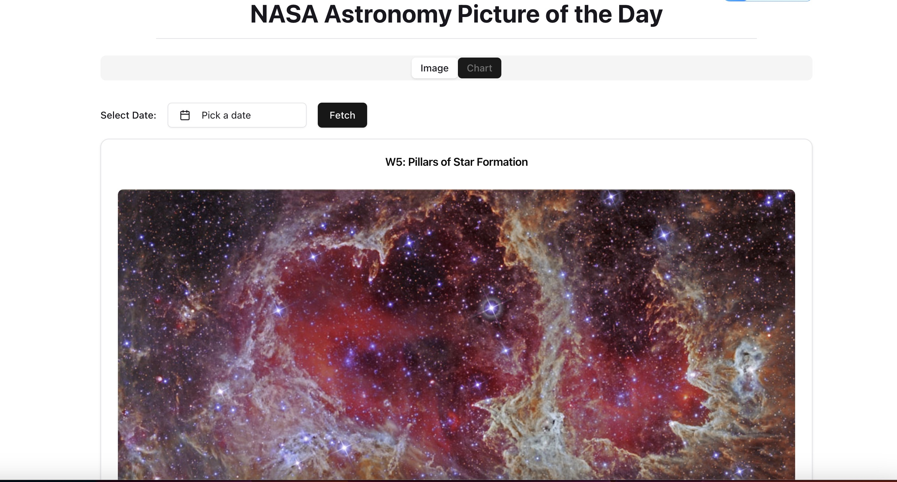

# NASA Astronomy Picture of the Day (APOD) Viewer

A simple React-based web app to browse NASA's "Astronomy Picture of the Day" (APOD), with date selection and chart support.

👉 **Live Demo:** [https://nasa-space-app-teal.vercel.app/](https://nasa-space-app-teal.vercel.app/)

---

## 🌟 Features

- 🌐 Online access: [https://nasa-space-app-teal.vercel.app/](https://nasa-space-app-teal.vercel.app/)
- 📅 Select any date to view corresponding APOD image
- 📊 Chart view (optional) for related data visualization
- 💡 Skeleton loading placeholder while fetching data
- 🎨 Responsive UI with shadcn/ui + Tailwind CSS
- 🚀 Lazy loading of components and API data (Performance optimization)

---

## 🛠️ Tech Stack
- Frontend: **React + Vite + Tailwind CSS + shadcn/ui + Recharts**
- Backend: **Node.js + Express** 
- Deployment: **Vercel (Frontend)** + **Render (Backend)**
- [React](https://react.dev/)
- [Vite](https://vitejs.dev/)
- [Tailwind CSS](https://tailwindcss.com/)
- [shadcn/ui](https://ui.shadcn.com/) components
- [NASA APOD API](https://api.nasa.gov/)

---

## 📸 Demo Screenshot



## 🚀 Getting Started

### Prerequisites

- Node.js >= 18.x
- npm >= 9.x

### 1️⃣ Clone the Repository

```bash
git clone https://github.com/your-username/nasa-space-app.git
cd nasa-space-app
```
### 2️⃣ Setup Backend   

```bash
cd backend
npm install
npm start
```

### 3️⃣ Setup Frontend
```bash
cd frontend
npm install
npm run dev
```
## 🧪 Testing

### 1️⃣ Unit Tests (Jest + React Testing Library)

- Frontend unit tests are written using [Jest](https://jestjs.io/) and [React Testing Library](https://testing-library.com/docs/react-testing-library/intro/).
- The following components and pages are covered with unit tests:
  - `Button` component (basic rendering)
  - Main `App.jsx` (mock API calls with axios and test title rendering)

### Example test command:

```bash
cd frontend
npm run test
```